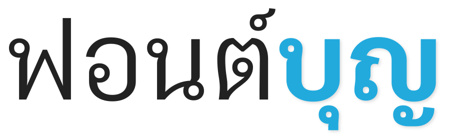

{: .banner}

**บุญ** คือ ชุดตัวอักษรตระกูลหนึ่ง (font family) ที่มุ่งแสดงผลการจัดเรียงตัวอักษรไทยให้ถูกต้องในเว็บบราวเซอร์ ตัวอักษรทุกตัวทั้งไทย, ละติน และลาว นั้นวาดขึ้นจากรูปทรงเลขาคณิตเพื่อความเรียบง่าย โดยตั้งใจให้สามารถใช้งานได้ดีทั้งส่วนที่เป็นยูเซอร์อินเตอร์เฟสและส่วนที่เป็นเนื้อความ

-----

### ๏ ภาษาที่รองรับ

นอกจากตัวอักษรไทยและลาวแล้ว ฟอนต์บุญตั้งแต่เวอร์ชั่น 1.0 ขึ้นไปยังมีตัวอักษรละตินครอบคลุมมากกว่า [Adobe Latin-4](https://adobe-type-tools.github.io/adobe-latin-charsets/adobe-latin-4.html) หมายความว่าครอบคลุมเกือบทุกภาษาในยุโรป อเมริกา รวมถึงภาษาเวียดนามด้วย [ดูหน้าทดสอบภาษา](languages.html)

-----

### ๏ ทดสอบการแสดงผล

- [หน้าทดสอบ OpenType features](features.html) เป็นสไลด์โชว์ที่เปลี่ยนน้ำหนักและสไตล์ของฟอนต์ได้ตรงมุมบนด้านขวาสุดในหน้านั้น
- [หน้าทดสอบ Hinting](hinting.html) เพื่อตรวจเช็คความสม่ำเสมอและความคมชัดของตัวอักษรหลายขนาด

-----

### ๏ ความเปลี่ยนแปลงในแต่ละเวอร์ขั่น

คุณสามารถอ่านได้จาก [FONTLOG](FONTLOG.html)

-----

### ๏ สัญญาอนุญาต

&copy; ๒๕๕๖-๒๕๕๘ [สังศิต ไสววรรณ](https://sungsit.com/)

**ฟอนต์บุญ** ใช้สัญญาอนุญาต (license) แบบ [SIL Open Font License v1.1](http://scripts.sil.org/OFL) แปลว่าคุณมีอิสระเต็มที่ในการใช้งาน ดัดแปลง หรือปรับปรุง เงื่อนไขคือเมื่อดัดแปลงจากต้นแบบแล้วอยากจะเผยแพร่ผลงานใหม่ก็ต้องใช้สัญญาอนุญาตแบบเดียวกันและต้องเปิดเผยซอร์สโค้ดเช่นกัน

-----

[๏ ดาวน์โหลดบุญ ๛](https://github.com/fontuni/boon/releases)
{: #download .boon-700}

-----

### ๏ แจ้งปัญหาการใช้งาน

หากคุณพบปัญหาในการใช้งานฟอนต์บุญก็สามารถแจ้งกันเข้ามาได้ที่ <https://github.com/fontuni/boon/issues> หรือพูดคุยอย่างกันเป็นเองที่ [ชุมชนสาวก f0nt](http://www.f0nt.com/forum/index.php/topic,22976.0.html) **ขอขอบคุณ สาวก f0nt ทุกท่านที่ให้ความเห็นและช่วยทดสอบฟอนต์บุญไว้ ณ ที่นี่ด้วยครับ**

